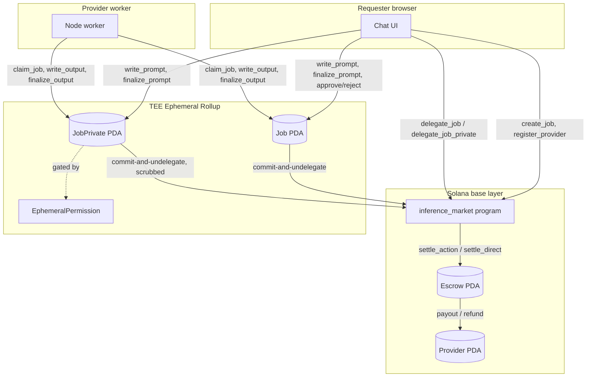

# Private Inference Network

A private inference marketplace on Solana devnet. A requester posts a prompt, a
provider answers it off-chain, and both the prompt and the answer stay hidden
from everyone except the two of them while the job is live. Settlement in SOL
happens on the Solana base layer once the requester approves.

The privacy comes from a MagicBlock TEE (trusted execution environment)
Ephemeral Rollup: a delegated copy of the job's private state lives on
MagicBlock's validator inside the TEE, gated by an `EphemeralPermission` that
lists only the requester and, once claimed, the provider. Everything else —
the provider registry, the SOL escrow, and the public job record — stays on
Solana's base layer the whole time.

The design spec states the trust model plainly, and one line is worth quoting
verbatim because it is the honest limit of what this system proves:

> The TEE is MagicBlock's validator, not the provider's machine.

In full, the trust model breaks into six claims of different strength:

- Prompt and output bytes are unreadable by non-members while the job is live
  on the private Ephemeral Rollup (PER). This is a protocol guarantee, backed
  by `EphemeralPermission` with `is_private = true` on the TEE validator.
- Prompt and output bytes never reach the base layer in plaintext. This is an
  application policy: every terminal instruction zeroes both fields on the
  rollup before commit-and-undelegate.
- The provider actually ran the claimed model is not provided by this system
  at all. Nothing in the design attests provider compute, because the TEE is
  MagicBlock's validator, not the provider's machine.
- Output integrity after settlement is integration-validated: `prompt_hash`
  and `output_hash` (SHA-256) are committed on the base layer, so either party
  can later prove what was exchanged.
- The provider is paid only if the requester approves. This is an application
  policy enforced by the settle instruction, which pays out only when the job
  status is `Approved` and refunds otherwise.
- A requester who reads the output and then withholds approval costs the
  provider nothing but reputation: a rejection increments the provider's
  `rejected` counter, with no economic penalty and no requester-side record.

## Architecture



Account table:

| Account | Lives on | Notes |
| --- | --- | --- |
| `Provider` | base layer, permanently | Reputation counters (`completed`, `rejected`); never delegated. |
| `Job` | base layer, delegated to the TEE rollup while a job is live | Public status, price, deadline, model label, prompt/output hashes. |
| `JobPrivate` | base layer, delegated to the TEE rollup while a job is live | The actual prompt and output bytes; scrubbed to zero before the final commit back to base. |
| `Escrow` | base layer only, never delegated | Holds the job's SOL; released by `settle_action` or `settle_direct`. |

## How a chat message becomes a job

The requester's UI is chat-first: one user message becomes one on-chain job.
Publishing a message runs four steps on the TEE Ephemeral Rollup, observed
directly rather than simulated by a timer. The four rollup steps are:

1. **Sealing** — `create_job` on the base layer, funding the escrow and the
   permission rent.
2. **Delegating** — `delegate_job` and `delegate_job_private` move both PDAs to
   the TEE validator; the client polls the router's `getDelegationStatus` until
   both report the same `fqdn` (`https://devnet-tee.magicblock.app/` in the
   devnet runs).
3. **Permissions** — `init_permissions` opens the `EphemeralPermission` on the
   rollup, initially listing only the requester.
4. **Prompt** — the prompt is streamed in with `write_prompt` chunks and
   finalized with `finalize_prompt`, which computes the SHA-256 `prompt_hash`
   on-chain and flips the job to `Open`.

After that, a provider worker calls `claim_job`, reads the prompt, answers it,
and submits the reply through `write_output` / `finalize_output`. The
requester's UI polls the rollup, shows the answer once `finalize_output`
lands, and offers **Approve** or **Reject**.

The prompt is capped at 4096 bytes. The client builds each prompt as a short
system preamble plus as much of the conversation as fits under that cap,
trimming the oldest turns first so the newest context always survives; if even
the newest turn alone is too long, that turn itself is truncated rather than
rejected. The output is capped at 5120 bytes. Both caps come from a single
Solana constraint: an account created through a CPI (`Anchor::init`) cannot
exceed 10,240 bytes, which rules out a symmetric 4096/8192 split.

## Privacy

`JobPrivate` carries the actual prompt and output bytes and is gated by an
`EphemeralPermission`. Its member list changes exactly twice in a job's life:

1. At `init_permissions`, the permission lists only the requester. A read of
   `JobPrivate` by anyone else — including a provider who has not claimed the
   job yet — is rejected by the TEE validator.
2. At `claim_job`, the provider is added as a second member. From that instant
   the provider can read the prompt; the requester's membership never changes.

Neither membership state is ever public. Before any terminal instruction
(`approve_job`, `reject_job`, `cancel_job`, `expire_job`) commits the job back
to the base layer, it zeroes `JobPrivate`'s prompt bytes, output bytes, and
both length fields, then closes both permission accounts. Only the zeroed
account, plus the two SHA-256 hashes recorded earlier on `Job`, ever lands on
the public base layer. Permission membership is not treated as an
authorization check anywhere in the program; every instruction still enforces
its own signer and status checks independently.

## Settlement

Every terminal instruction ends the same way: set the job's status, scrub
`JobPrivate`, close both permissions, then call
`commit_and_undelegate(&[job, job_private])` with a post-**undelegate** action
(`settle_action`) attached. The action must run after undelegation, not after
the commit alone, because `settle_action` requires `Job` to already be owned
by the program again; scheduling it as a post-commit action (the SDK's more
common example) makes it read a still-delegated account and fail with
`JobStillDelegated`. `settle_action`'s escrow account is checked as a signer
pinned to the terminal signer's own funded ephemeral balance PDA, so a stray
or forged call cannot move funds.

If the Magic Action is stripped, fails, or is never scheduled (a caller can
pass `schedule_action = false`, which is how any wallet without a funded
balance PDA calls `expire_job`), the escrow is not paid automatically. Any
party can then call the permissionless `settle_direct` instruction, which
shares the same underlying settlement logic and is idempotent: a repeat call
returns `AlreadySettled` without moving funds again.

Two more paths close fund-lock gaps that the base transition table alone would
leave open:

- **`cancel_job_base`** lets a requester refund a job that was created but
  never delegated, since `cancel_job` on the rollup requires the pair to
  already be delegated.
- **Auto-approve** — once a job has been `Submitted` for
  `deadline_unix + 3600` seconds, anyone can call `approve_job` on the
  requester's behalf, so an absent requester cannot lock a provider's payment
  forever.

## Prerequisites

- WSL2, Ubuntu 24.04.
- Rust 1.89.0 (`rustup install 1.89.0`).
- Solana Agave CLI (installed via `https://release.anza.xyz/stable/install`).
- Anchor 1.0.2, installed from the `v1.0.2` tag directly rather than through
  `avm`, because `avm` on its main branch requires a newer `rustc` than
  1.89.0:
  ```bash
  cargo install --git https://github.com/coral-xyz/anchor --tag v1.0.2 anchor-cli --locked
  ```
- Node 24.
- `npm install --no-bin-links` at the repo root. Plain `npm install` fails
  with an `EPERM`/`chmod` error on a WSL DrvFS (NTFS) mount for a transitive
  dependency; `--no-bin-links` avoids the failing step.
- `CARGO_TARGET_DIR` set to a path outside `/mnt` (for example
  `$HOME/target/inference-market`). Building with the target directory on the
  NTFS mount fails at the final `llvm-objcopy` step with the same class of
  permission error.

## Run

Build and run the local Anchor test suite:

```bash
bash scripts/test-local.sh
```

This runs `anchor build`, copies the artifact into `target/deploy/`, and runs
`anchor test --skip-build --validator legacy`.

Run the pure-logic unit tests alone:

```bash
cargo test -p inference_market --lib
```

Deploy to devnet (already done for this program; shown for a redeploy):

```bash
anchor build
solana program deploy target/deploy/inference_market.so \
  -u https://rpc.magicblock.app/devnet --use-rpc --max-sign-attempts 60
```

Run the devnet end-to-end test:

```bash
npm run test:devnet
```

Run the provider worker, after copying `worker/.env.example` to `worker/.env`
and filling in a funded keypair path and an inference API key:

```bash
npm --workspace worker start
```

Run the web app:

```bash
npm --workspace app run dev
```

Routes: `#/` (landing), `#/chat` (default, the requester chat surface),
`#/jobs` (ledger and detail view), `#/provider` (registration and provider
dashboard).

After any change to the Anchor program, resync the IDL the client and app
depend on:

```bash
npm run idl:sync
```

## Demo

1. Open the app, connect a devnet wallet with SOL, and land on `#/chat`.
2. Send a message. Watch the four-step publish stepper: sealing, delegating,
   permissions, prompt. Each step lights up only once the client has actually
   observed it (delegation status from the router, the permission account
   appearing on the rollup), not on a fixed timer.
3. Start the provider worker separately, pointed at the same devnet program
   with a model label matching the job's. It claims the job, reads the
   prompt, and submits an answer within its poll interval.
4. Wait for the answer. It appears in the chat in one piece, once the provider's
   `finalize_output` lands on the rollup.
5. Click **Approve**. The message moves to "settling," then "settled" once the
   escrow reports paid, whether that happens through the atomic Magic Action
   or the `settle_direct` fallback.
6. Check the provider's SOL balance increased by the job's price and its
   `completed` counter went up by one.
7. As an outsider (a wallet with no relationship to the job), attempt to read
   the `JobPrivate` account directly on the TEE endpoint. The read is
   rejected, because that wallet is not a member of the job's
   `EphemeralPermission`.

## Limits and non-goals

- Prompt capped at 4096 bytes, output at 5120 bytes.
- SOL only; no SPL token payment path.
- No staking, slashing, or third-party arbitration of disputes. A rejection
  only affects the provider's on-chain reputation counter.
- Reputation is the only deterrent against bad behavior on either side.
- Devnet only; this has not been deployed to mainnet.
- Conversations are stored per browser per wallet, in `localStorage` under
  `im.chat.v1.<wallet pubkey>`. They are not on chain, not synced across
  devices, and not shown at all until a wallet is connected.
- Nothing in this system proves which model a provider actually ran.

## Links

- Design spec: `docs/superpowers/specs/2026-09-04-private-inference-network-design.md`
- Implementation plan: `docs/superpowers/plans/2026-09-04-private-inference-network.md`
- Visual design canvas ("Calm"): https://claude.ai/code/artifact/a48fd524-3dd6-4920-820c-e8b577dcbe7f
